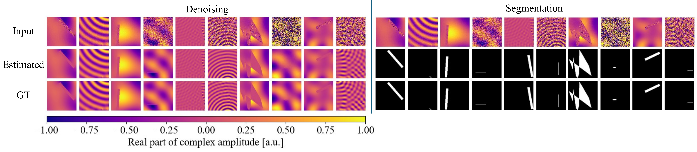

# SoundSil-DS: Deep Denoising and Segmentation of Sound-field Images with Silhouettes


The official PyTorch implementation of the paper
> [SoundSil-DS: Deep Denoising and Segmentation of Sound-field Images with Silhouettes](https://arxiv.org/abs/2411.07517)


## What is SoundSil-DS?
The SoundSil-DS is a deep learning model for noise reduction in sound-field images with object silhouettes measured by optical methods, such as interferometer and holography. This is a continuous work of [Deep Sound-Field Denoiser](https://github.com/nttcslab/deep-sound-field-denoiser). It treats the complex-valued amplitude of the sound field in the frequency domain as a 2-channel image consisting of real and imaginary parts, and performs noise reduction and object-silhouette segmentation using a network based on [CascadedGaze](https://github.com/Ascend-Research/CascadedGaze). The network has been trained using a sound-field image dataset we created using 2D acoustic simulations. The dataset includes noisy data with additive Gaussian white noise.




## Getting started
Our code is based on [CascadedGaze](https://github.com/Ascend-Research/CascadedGaze).

1. Download [trained weights](https://zenodo.org/records/14085791) and place them in the 'trained_weights' directory.

3. Download [dataset](https://zenodo.org/records/14086038) and place them in the 'dataset' directory. When you run evaluation.py, 'evaluatation' directory from the dataset is required. When you run train.py, 'training' and 'validation' directories are required.

4. Install dependencies.
```sh
pip install -r requirements.txt
```

## Use SoundSil-DS

### Quick demo by jupyter notebook

[demo.ipynb](demo.ipynb) provides a simple demo including loading a sound field from evaluation dataset, performing denoising and segmentation by pretrained weights, and displaying true, noisy, and denoised images.

### Evaluation

To evaluate metrics and save denoised data on evaluation dataset, run

```sh
python evaluate.py --config config.yml
```

You can specify parameters for evaluation by the properties below 'eval' section in [config.yml](config.yml). The evaluation results will be saved into 'save_dir' directory of 'evaluation' section in the yaml file, a sub directory with the timestamp as its name will be automatically generated.

### Training

To train your model, run

```sh
python train.py --config config.yml
```

You can specify parameters for training by the properties below 'train' and 'validation' sections in [config.yml](config.yml).

## License

Read the [NTTSoftwareLicenseAgreement.pdf](NTTSoftwareLicenseAgreement.pdf).


# Citation
If you use SoundSil-DS, or this codebase in your work, please consider citing this work:
```
@misc{tanigawa2024soundsilds,
      title={SoundSil-DS: Deep Denoising and Segmentation of Sound-field Images with Silhouettes}, 
      author={Risako Tanigawa and Kenji Ishikawa and Noboru Harada and Yasuhiro Oikawa},
      year={2024},
      eprint={2411.07517},
      archivePrefix={arXiv},
      primaryClass={eess.SP},
      url={https://arxiv.org/abs/2411.07517}, 
}

```

